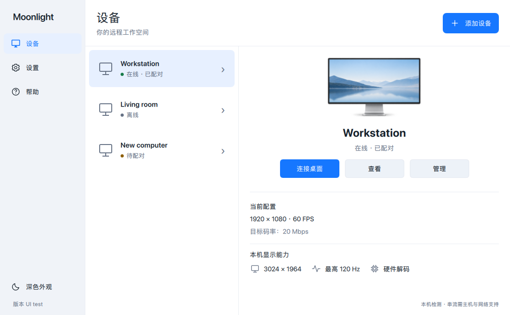
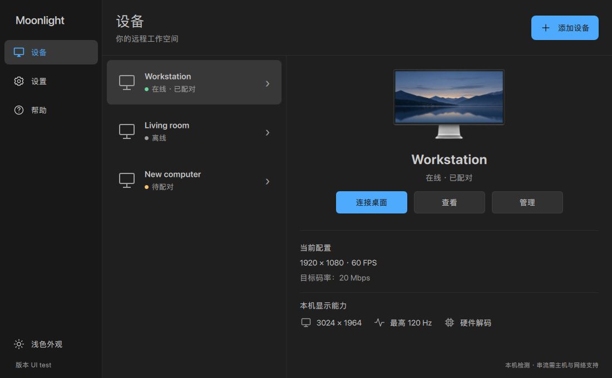

# Moonlight PC

## 桌面界面重构版

由 [@coderleexl](https://github.com/coderleexl) 维护的 Moonlight Qt 界面重构版本，面向远程办公并兼顾游戏串流，基于 [上游 Moonlight Qt](https://github.com/moonlight-stream/moonlight-qt)。

[下载 Windows 预览版](https://github.com/coderleexl/moonlight-qt/releases/tag/v6.1.0-desk-preview.1) · [本仓库源码](https://github.com/coderleexl/moonlight-qt) · [问题反馈](https://github.com/coderleexl/moonlight-qt/issues)

### 运行界面预览

以下截图由实际 QML 界面运行渲染，设备列表与能力参数使用示例数据。

| 浅色 | 深色 |
| --- | --- |
|  |  |

### 本次界面更新

- 蓝白浅色与简约黑灰深色主题，默认窗口为 1100 × 680；固定侧栏、设备列表与详情区支持窗口缩放。
- **连接桌面**直接启动或恢复主机提供的 `Desktop` 应用，独立于直启应用设置；其他应用正在运行时保留退出确认。未找到 `Desktop` 时提示在 Sunshine 中添加。
- **查看**打开完整应用列表，支持列表与网格切换；设备页保留配对、唤醒功能，**管理**提供重命名、删除、网络测试等入口。
- 显示当前串流配置，以及本机显示器的原生分辨率、该分辨率下的最高刷新率和硬件／软件解码检测状态。
- 设置按功能分类；统一按钮、弹窗、键盘焦点和连接状态界面，并补充简体／繁体中文翻译。

主题切换目前仅在当前运行期间生效。本机能力为检测结果，实际串流效果还取决于主机、编码配置与网络；界面缩放独立于串流分辨率。

### macOS 开发运行

本地已使用 Mac ARM64、Qt 6.11.0 完成 Release 编译。安装 Qt 并准备好子模块及依赖后，在仓库根目录运行：

```sh
qmake moonlight-qt.pro
make release -j8
open app/Moonlight.app
```

首次准备依赖请参见下方 [Build Setup Steps](#build-setup-steps)。请使用本仓库源码构建此界面版本；下方上游安装包不包含本次界面改动。开发产物位于 `app/Moonlight.app`，分发打包仍使用原有构建脚本。

### Windows 独立测试版：Moonlight Desk Preview

在 [GitHub Releases](https://github.com/coderleexl/moonlight-qt/releases/tag/v6.1.0-desk-preview.1) 下载 Windows x64 预览版，选择一种即可，两者均包含从源码编译的 Sunshine：

- **安装版（推荐）**：[MoonlightDeskPreview-Setup-x64.exe](https://github.com/coderleexl/moonlight-qt/releases/download/v6.1.0-desk-preview.1/MoonlightDeskPreview-Setup-x64.exe)，下载后直接安装。
- **免安装版**：[MoonlightDeskPreview-x64.zip](https://github.com/coderleexl/moonlight-qt/releases/download/v6.1.0-desk-preview.1/MoonlightDeskPreview-x64.zip)，解压后运行 `MoonlightDeskPreview.exe`。

安装包由 [Windows Desk Preview 构建流程](https://github.com/coderleexl/moonlight-qt/actions/workflows/build-windows-preview.yml) 生成。Actions 中单独的 `sunshine-preview-x64` 是构建中间产物，无需另行下载。

测试版使用独立标识，可与原版共存：

| 项目 | 测试版 |
| --- | --- |
| 应用 / 可执行文件 | Moonlight Desk Preview / `MoonlightDeskPreview.exe` |
| 安装目录 | `%LOCALAPPDATA%\Programs\MoonlightDeskPreview` |
| 设置与配对身份 | `HKCU\Software\coderleexl\MoonlightDeskPreview` |
| 主机端口 / Web 配置端口 | `48989` / `48990` |
| 安装与卸载 | 独立 AppId，仅当前用户，无需覆盖原版 |

安装后在“本机”页面启动服务，按“配置与配对 → 添加本机 → 配对 → 连接桌面”测试。默认只监听本机。其他设备连接 Windows 时，先停止服务并关闭“仅本机测试”，重新启动后添加 `Windows 局域网 IP:48989`；必要时允许内置 Sunshine 通过 Windows 防火墙的专用网络。退出应用会停止内置服务。本版不自动安装 Sunshine 系统服务、驱动或开机启动项。

**Windows 不会自动弹出配对输入框。** 在 Windows 预览版点击“配置与配对”，打开 `https://127.0.0.1:48990`，首次使用先设置并登录 Sunshine 管理账号。在另一台设备发起配对，保持 PIN 弹窗打开，将四位数字输入 Windows 管理网页的 PIN 页面并提交。`48989` 是客户端连接端口，`48990` 是管理网页端口。

当前关闭客户端 PIN 弹窗不会取消主机上等待中的配对。重复点击可能返回 `409: A pairing session with this uniqueid already exists`；此时在 Windows 预览版停止并重新启动服务，保持“仅本机测试”关闭，再发起一次配对。原版 Sunshine 与预览版的配对记录独立，预览版需要重新配对。

构建流程包含 Windows 进程管理测试、安装／卸载检查、客户端启动和 Sunshine Web 配置页启动检查；GPU 编解码、真实串流、锁屏／UAC 和手柄驱动需在目标电脑上实测。安装包尚未签名，可能出现 SmartScreen 提示。

本地 Windows 开发时，先按工作流中的 MSYS2 步骤编译 Sunshine 并执行 `cmake --install` 得到服务目录，再在安装 Qt 6.11 MSVC、Inno Setup 6 的 x64 MSVC 开发命令行中运行：

```powershell
./setup-deps.ps1
./scripts/build-preview-windows.ps1 -SunshinePayload ./build/sunshine-payload
```

该脚本使用 `CONFIG+=host_preview` 构建独立身份，输出位于 `build/preview-installer/`。普通构建仍使用原有应用身份。ZIP 解压版同样使用测试版的用户配置，不与原版共享设置。

### 内置 Sunshine（macOS 实验功能）

正在接入源码构建的 Sunshine，固定版本为 `v2026.914.233613`（`63d35f7`），源码位于 `third_party/sunshine` 子模块。整合产物将服务放在 `Moonlight.app/Contents/Helpers/Sunshine.app` 内，无需单独安装 Sunshine App；运行时仍有独立的后台进程，由 Moonlight 管理。

开发依赖：原有 Moonlight 构建环境，以及 Homebrew 的 `cmake ninja pkg-config boost openssl@3 opus miniupnpc node`。构建脚本会初始化 Sunshine 所需子模块，下载其构建依赖，并编译服务与 Web 配置页面：

```sh
./scripts/build-integrated-macos.sh
open app/Moonlight.app
```

脚本生成本机开发签名的应用，尚未作为可分发安装包验证。普通 `qmake` 构建仅编译管理界面，不会自动下载或编译 Sunshine；缺少内置服务时，“本机”页会提示且禁用启动。

本机闭环测试步骤：

1. 打开侧栏“本机”，保留“仅本机测试（127.0.0.1）”，启动服务。
2. 在“配置与配对”中设置 Sunshine 登录账号；按 macOS 提示授予屏幕录制权限，远程键鼠输入还需要辅助功能权限，修改后重启服务。
3. 点击“添加本机”，在设备页发起配对，将 PIN 输入 Sunshine 配置页面。
4. 点击“连接桌面”。同屏串流会出现画面套娃；该测试可检查连接链路，不能代表真实网络延迟和远端输入体验。

默认不自动启动，不开启 UPnP；配置、凭据和日志位于 Moonlight 应用数据目录下的 `sunshine/`，不会接管单独安装的 Sunshine。允许局域网连接时，先停止服务，再关闭“仅本机测试”。退出 Moonlight 会停止它启动的服务，目前不支持无人值守常驻。**当前管理代码已编译并通过进程管理测试；当前源码及依赖下载因网络中断未完成，完整整合包和真实串流仍待验证。**

进程管理测试使用受控测试进程，覆盖服务缺失、端口占用、启停、配置保留、异常退出和退出清理，不代替真实 Sunshine 串流测试：

```sh
mkdir -p build/sunshine-manager-test/Contents/MacOS
cd build/sunshine-manager-test/Contents/MacOS
qmake ../../../../tests/sunshine-manager/sunshine-manager.pro
make -j8
./sunshine-manager-test
```

## 上游项目说明

下面保留上游的功能、下载与跨平台构建说明；其中的下载链接指向上游发行版。

[Moonlight PC](https://moonlight-stream.org) is an open source PC client for NVIDIA GameStream and [Sunshine](https://github.com/LizardByte/Sunshine).

Moonlight also has mobile versions for [Android](https://github.com/moonlight-stream/moonlight-android) and [iOS](https://github.com/moonlight-stream/moonlight-ios).

You can follow development on our [Discord server](https://moonlight-stream.org/discord) and help translate Moonlight into your language on [Weblate](https://hosted.weblate.org/projects/moonlight/moonlight-qt/).

 [](https://github.com/moonlight-stream/moonlight-qt/actions/workflows/build.yml?query=branch%3Amaster)
 [](https://github.com/moonlight-stream/moonlight-qt/releases)
 [](https://hosted.weblate.org/projects/moonlight/moonlight-qt/)

## Features
 - Hardware accelerated video decoding on Windows, Mac, and Linux
 - H.264, HEVC, and AV1 codec support (AV1 requires Sunshine and a supported host GPU)
 - YUV 4:4:4 support (Sunshine only)
 - HDR streaming support
 - 7.1 surround sound audio support
 - 10-point multitouch support (Sunshine only)
 - Gamepad support with force feedback and motion controls for up to 16 players
 - Support for both pointer capture (for games) and direct mouse control (for remote desktop)
 - Support for passing system-wide keyboard shortcuts like Alt+Tab to the host
 
## Downloads
- [Windows, macOS, and Steam Link](https://github.com/moonlight-stream/moonlight-qt/releases)
- [Snap (for Ubuntu-based Linux distros)](https://snapcraft.io/moonlight)
- [Flatpak (for other Linux distros)](https://flathub.org/apps/details/com.moonlight_stream.Moonlight)
- [AppImage](https://github.com/moonlight-stream/moonlight-qt/releases)
- [Raspberry Pi 4 and 5](https://github.com/moonlight-stream/moonlight-docs/wiki/Installing-Moonlight-Qt-on-Raspberry-Pi-4)
- [Generic ARM 32-bit and 64-bit Debian packages](https://github.com/moonlight-stream/moonlight-docs/wiki/Installing-Moonlight-Qt-on-ARM%E2%80%90based-Single-Board-Computers) (not for Raspberry Pi)
- [Experimental RISC-V Debian packages](https://github.com/moonlight-stream/moonlight-docs/wiki/Installing-Moonlight-Qt-on-RISC%E2%80%90V-Single-Board-Computers)
- [NVIDIA Jetson and Nintendo Switch (Ubuntu L4T)](https://github.com/moonlight-stream/moonlight-docs/wiki/Installing-Moonlight-Qt-on-Linux4Tegra-(L4T)-Ubuntu)

### Nightly Builds
- [Downloads](https://nightly.link/moonlight-stream/moonlight-qt/workflows/build/master)

#### Special Thanks

[](https://cloudsmith.com)

Hosting for Moonlight's Debian and L4T package repositories is graciously provided for free by [Cloudsmith](https://cloudsmith.com).

## Building

### Windows Build Requirements
* Qt 6.11 SDK or later (earlier versions may work but are not officially supported)
* [Visual Studio 2026](https://visualstudio.microsoft.com/downloads/) (Community edition is fine)
* Select **MSVC** option during Qt installation. MinGW is not supported.
* [7-Zip](https://www.7-zip.org/) (only if building installers for non-development PCs)
* Graphics Tools (only if running debug builds)
  * Install "Graphics Tools" in the Optional Features page of the Windows Settings app.
  * Alternatively, run `dism /online /add-capability /capabilityname:Tools.Graphics.DirectX~~~~0.0.1.0` and reboot.

### macOS Build Requirements
* Qt 6.11 SDK or later (earlier versions may work but are not officially supported)
* Xcode 15 or later (earlier versions may work but are not officially supported)
* [create-dmg](https://github.com/sindresorhus/create-dmg) (only if building DMGs for use on non-development Macs)

### Linux/Unix Build Requirements
* Qt 6 is recommended, but Qt 5.12 or later is also supported (replace `qmake6` with `qmake` when using Qt 5).
* GCC or Clang
* FFmpeg 4.0 or later
* Install the required packages:
  * Debian/Ubuntu:
    * Base Requirements: `libegl1-mesa-dev libgl1-mesa-dev libopus-dev libsdl2-dev libsdl2-ttf-dev libssl-dev libavcodec-dev libavformat-dev libswscale-dev libva-dev libvdpau-dev libxkbcommon-dev wayland-protocols libdrm-dev`
    * Qt 6 (Recommended): `qt6-base-dev qt6-declarative-dev libqt6svg6-dev qt6-wayland qml6-module-qtquick-controls qml6-module-qtquick-templates qml6-module-qtquick-layouts qml6-module-qtqml-workerscript qml6-module-qtquick-window qml6-module-qtquick`
    * Qt 5: `qtbase5-dev qt5-qmake qtdeclarative5-dev qtquickcontrols2-5-dev qml-module-qtquick-controls2 qml-module-qtquick-layouts qml-module-qtquick-window2 qml-module-qtquick2 qtwayland5`
  * RedHat/Fedora (RPM Fusion repo required):
    * Base Requirements: `openssl-devel SDL2-devel SDL2_ttf-devel ffmpeg-devel libva-devel libvdpau-devel opus-devel pulseaudio-libs-devel alsa-lib-devel libdrm-devel`
    * Qt 6 (Recommended): `qt6-qtsvg-devel qt6-qtdeclarative-devel`
    * Qt 5: `qt5-qtsvg-devel qt5-qtquickcontrols2-devel`
* Building the Vulkan renderer requires a `libplacebo-dev`/`libplacebo-devel` version of at least v7.349.0 and FFmpeg 6.1 or later.

### Steam Link Build Requirements
* [Steam Link SDK](https://github.com/ValveSoftware/steamlink-sdk) cloned on your build system
* STEAMLINK_SDK_PATH environment variable set to the Steam Link SDK path

**Steam Link Hardware Limitations**  
Moonlight builds for Steam Link are subject to hardware limitations of the Steam Link device:
* Maximum resolution: **1080p (1920x1080)**
* Maximum framerate: **60 FPS**
* Maximum video bitrate: **40 Mbps**
* **HDR streaming is not supported** on the original hardware

### Docker containers
If you want to use Docker for building, look at [this repo](https://github.com/cgutman/moonlight-packaging) containing canonical containers
for different architectures, which handle building deps and extra linking for you.

### Build Setup Steps
1. Install the latest Qt SDK (and optionally, the Qt Creator IDE) from https://www.qt.io/download
    * You can install Qt via Homebrew on macOS, but you will need to use `brew install qt --with-debug` to be able to create debug builds of Moonlight.
    * You may also use your Linux distro's package manager for the Qt SDK as long as the packages are Qt 5.12 or later.
    * This step is not required for building on Steam Link, because the Steam Link SDK includes Qt 5.14.
2. Download submodules and dependencies
    * Run `git submodule update --init --recursive` from within `moonlight-qt/`.
    * On Windows and macOS, you must also run `setup-deps.ps1` (Windows) or `setup-deps.py` (macOS).
    * Perform these steps each time you pull new changes from the Git repository.
3. Open the project in Qt Creator or build from qmake on the command line.
    * To build a binary for use on non-development machines, use the scripts in the `scripts` folder.
        * For Windows builds, use `scripts\build-arch.bat` and `scripts\generate-bundle.bat`. Execute these scripts from the root of the repository within a Qt command prompt. Ensure  7-Zip binary directory is on your `%PATH%`.
        * For macOS builds, use `scripts/generate-dmg.sh`. Execute this script from the root of the repository and ensure Qt's `bin` folder is in your `$PATH`.
        * For Steam Link builds, run `scripts/build-steamlink-app.sh` from the root of the repository.
    * To build from the command line for development use on macOS or Linux, run `qmake6 moonlight-qt.pro` then `make debug` or `make release`.
        * The final binary will be placed in `app/moonlight`.
    * To create an embedded build for a single-purpose device, use `qmake6 "CONFIG+=embedded" moonlight-qt.pro` and build normally.
        * This build will lack windowed mode, Discord/Help links, and other features that don't make sense on an embedded device.
        * For platforms with poor GPU performance, add `"CONFIG+=gpuslow"` to prefer direct KMSDRM rendering over GL/Vulkan renderers. Direct KMSDRM rendering can use dedicated YUV/RGB conversion and scaling hardware rather than slower GPU shaders for these operations.

## Contribute
1. Fork us
2. Write code
3. Send Pull Requests

Check out our [website](https://moonlight-stream.org) for project links and information.
